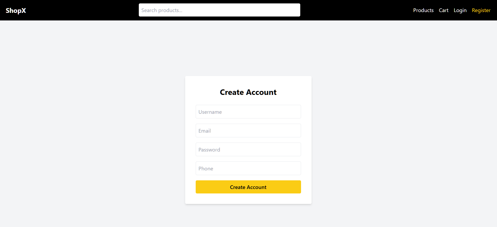
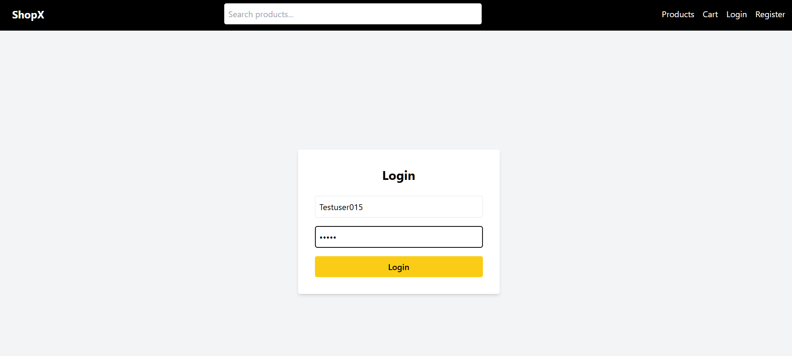
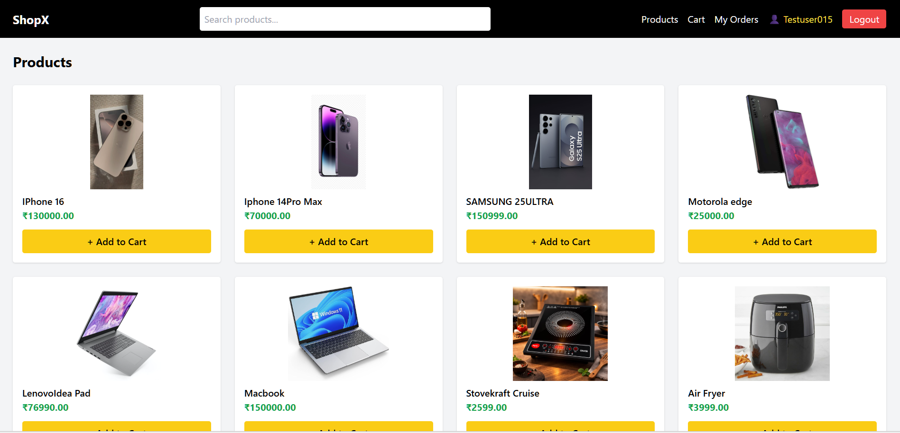
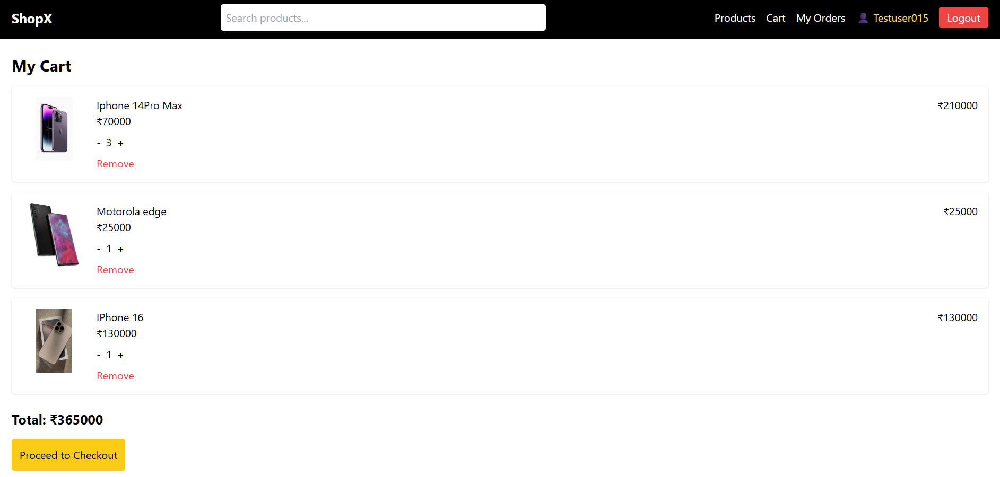

#  Ecommerce Frontend (React)

This is the frontend of the Ecommerce application built using React. It connects with Django backend APIs.

---

##  Features

- Product Listing
- Product Detail Page
- Add to Cart
- Cart UI
- User Login & Register
- JWT Authentication
- Search Functionality
- Order History

---
##  Screenshots

###  Home Page


---

###  Login Page

---
###  Product Page


---

###  Cart Page



---
## Tech Stack

- React.js
- Axios
- React Router DOM
- Tailwind CSS

---

##  Project Structure
src/
│
├── pages/
│ ├── Products.js
│ ├── ProductDetail.js
│ ├── Cart.js
│ ├── Orders.js
│ ├── Login.js
│ └── Register.js
│
├── components/
│ └── Navbar.js
│
├── api.js
├── App.js


---

##  Setup Instructions

### 1. Install Dependencies

```bash
npm install

2. Run App
npm start

App runs on:
http://localhost:3000

---
## Backend Connection
http://127.0.0.1:8000

